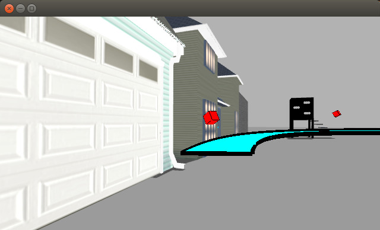
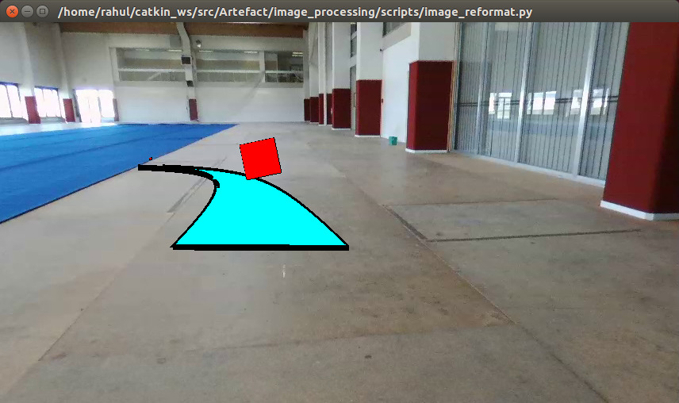
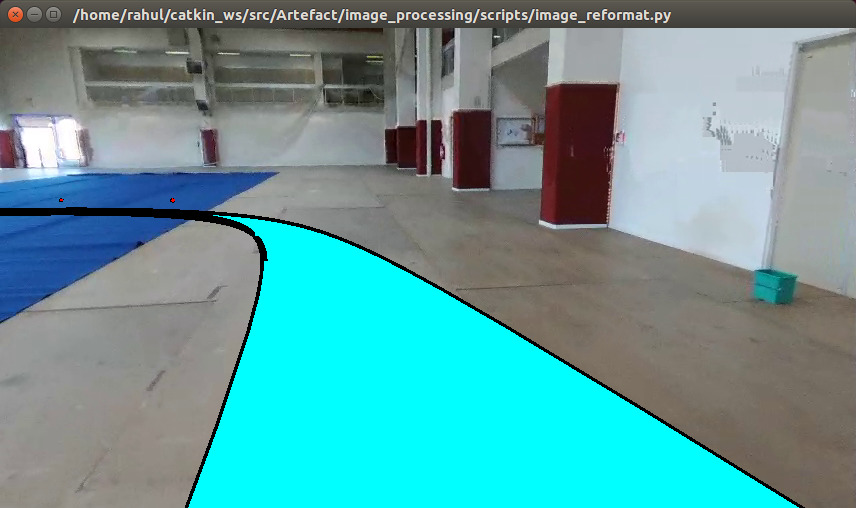

# Artefact

ARTEFACT stands for Augmented Reality Tool Enhancing Flight ACTions.
It aims to improve the flight experience with UAVs by inserting  spatially positioned objects despite the imprecision of UAV positioning systems.

# Installation guide

+ Install on target host
	1. ros-kinetic
	2. Install following packages using terminal
	```sh
	$ sudo install python-pip
	$ sudo apt-get install libglfw3-dev libglfw3
	$ python -m pip install --user numpy scipy matplotlib ipython jupyter pandas sympy nose
	$ sudo apt-get install libglu1-mesa-dev freeglut3-dev mesa-common-dev
	$ python -m pip install --user glumpy
	$ python -m pip install --user triangle
	$ python -m pip install --user cython
	$ sudo apt install ros-kinetic-ardrone-autonomy
	$ sudo apt install ros-kinetic-joy
	$ sudo apt install ros-kinetic-gps-common
	$ sudo apt install ros-kinetic-hector*
	```
+ Clone repository to src folder of your workspace
+ Run "catkin build" from workspace root. 
+ To start simulation, "roslaunch sim_launcher sim.launch"
+ To fly quadrotor, plug in an xbox360 or logitech joystick controller.



